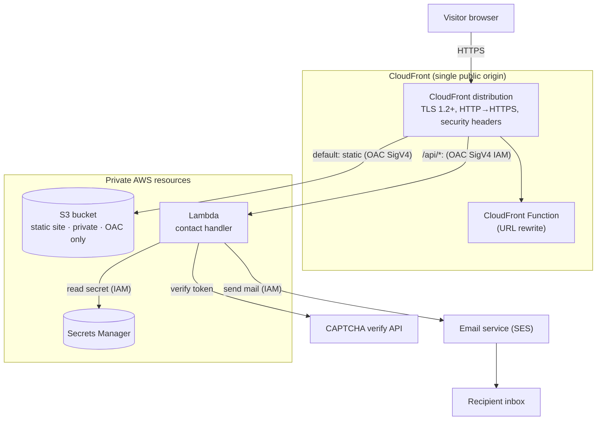
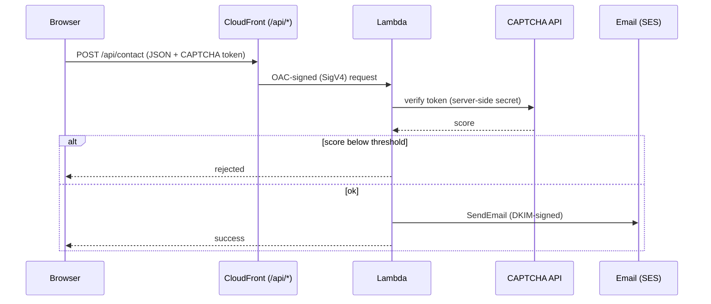
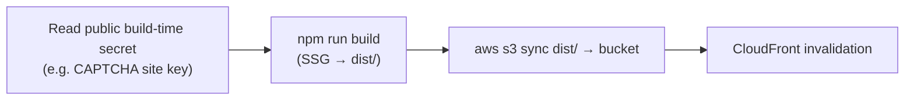

# Stack blueprint

A technology-agnostic description of how this repository is built, so the same
setup can be replicated for another project. Nothing here is specific to any one
business — it describes the **architecture, tooling, and infrastructure pattern**
only.

The pattern in one line: a **statically prerendered React site** on a **private
S3 bucket**, served through **CloudFront**, with a **serverless contact form**
(`/api/*` → Lambda → email), all provisioned with **Terraform** and shipped by a
single build-and-sync script.

---

## 1. High-level architecture



**Core idea:** everything is served from a **single origin** through CloudFront.
The S3 bucket and the Lambda are **not publicly reachable** — CloudFront signs
every origin request with SigV4 via **Origin Access Control (OAC)**. Because the
API is same-origin (`/api/*`), the browser needs **no CORS**.

---

## 2. Frontend

| Concern | Choice |
| --- | --- |
| Runtime / language | Node 22, TypeScript |
| UI library | React 19 |
| Bundler | Vite |
| Static generation | `vite-react-ssg` (prerenders each route to HTML for SEO) |
| Routing | `react-router-dom` v6 (the version `vite-react-ssg` supports) |
| Styling | CSS Modules + design tokens (CSS custom properties). **No inline styles** (enforced by ESLint + Stylelint) |
| Theming | `data-theme` attribute + CSS variables, persisted in `localStorage` |
| Internationalisation | `react-i18next`, one JSON locale file per language, `hreflang` + canonical tags |
| Forms | `react-hook-form` |
| Bot protection | reCAPTCHA v3 (score-based, invisible) |
| Optional 3D | `@react-three/fiber` + `@react-three/drei` (+ Rapier physics), **lazy-loaded, desktop-only**, split into its own chunk |

### SSG / prerender notes

- Each route is prerendered to a deterministic HTML file at build time — good
  first paint and full SEO without a server.
- i18n uses a **separate instance per language** so each prerendered page is
  deterministic (no shared mutable global state leaking between pages).
- Heavy, optional experiences (e.g. the 3D world) are **client-only** and
  **code-split**: they mount after hydration via a `ClientOnly` wrapper +
  `React.lazy`, and the eager `modulepreload` for that chunk is stripped in the
  build config so it is never downloaded on devices that won't use it.
- Third-party render roots that use their own reconciler (e.g. React Three
  Fiber's `<Canvas>`) do **not** share React context — pass data in as props or
  refs across that boundary.

### Project layout (app)

```
app/
  src/
    main.tsx           SSG entry
    routes.tsx         one route per language
    Layout.tsx         providers + SEO head + shell
    components/        header, footer, shared UI + controls
    sections/          one folder per page section
    three/             optional 3D world (lazy, desktop-only)
    context/           theme + experience (2D/3D) providers
    i18n/locales/      one JSON file per language (all copy)
    lib/               SEO head, site metadata, API client, captcha provider
    styles/            tokens.css (palette + theme vars), global.css
    assets/            fonts, logos, icons, textures
  public/              robots.txt, sitemap.xml, favicon
```

### Build & quality commands (run inside `app/`)

| Command | Purpose |
| --- | --- |
| `npm run dev` | Dev server |
| `npm run build` | SSG build → `dist/` (prerenders every route) |
| `npm run typecheck` | `tsc --noEmit` |
| `npm run lint` | ESLint + Stylelint |

---

## 3. Contact form data flow



Key points that make this work behind CloudFront OAC:

- The Lambda is exposed through a **Function URL** with `AWS_IAM` auth; CloudFront
  reaches it as an origin and signs requests via a **Lambda-type OAC**.
- For `POST`/`PUT` bodies the browser must send `x-amz-content-sha256` = the hex
  SHA-256 of the exact request body (SigV4 payload signing; CloudFront cannot
  hash the body itself). `GET` (no body) needs nothing extra.
- The `/api/*` behavior uses a **CachingDisabled** cache policy and an origin
  request policy that forwards everything **except the Host header**
  (`AllViewerExceptHostHeader`).
- The CAPTCHA **secret key** and any other secrets are read at runtime from a
  secrets store — never bundled into the client. The CAPTCHA **site key** (public)
  is injected at build time.

---

## 4. Infrastructure (Terraform)

All infrastructure is declared in Terraform (AWS provider `~> 6.0`) and follows
**least-privilege, private-by-default** principles. Every resource carries a
recognisable name prefix (`<project>-<environment>-`).

### Modules

```
tf/
  main.tf              wires the modules together
  variables.tf         inputs (domain, emails, thresholds, ...)
  outputs.tf           DNS records to create, distribution id, etc.
  providers.tf         default region + a us-east-1 alias for CloudFront/edge
  modules/
    site_bucket/       private S3 bucket (no public access, OAC read only)
    cdn/               CloudFront distribution + OAC + URL-rewrite function
    acm_cert/          ACM certificate (must be in us-east-1 for CloudFront)
    contact_api/       Lambda + email service + secrets
```

### What each piece does

- **site_bucket** — a fully private S3 bucket (public access blocked). Only
  CloudFront can read it, granted by a bucket policy that allows the CloudFront
  service principal **scoped to the distribution ARN** (`AWS:SourceArn`).
- **acm_cert** — a TLS certificate created **in `us-east-1`** (CloudFront only
  accepts certs from that region), validated via DNS.
- **cdn** — the CloudFront distribution with two origins:
  - default behavior → S3 (OAC signed, `CachingOptimized`, security-headers
    policy, HTTP→HTTPS redirect, TLS 1.2+), plus a **CloudFront Function** on
    viewer-request that rewrites extensionless URLs to the prerendered `.html`.
  - `/api/*` behavior → the Lambda Function URL (OAC signed, `CachingDisabled`,
    all-viewer-except-host).
  - `custom_error_response` maps 403/404 to the prerendered home page for
    SPA-style fallback (the private S3 origin returns 403 for missing keys).
- **contact_api** — the serverless backend:
  - Lambda (Python 3.12, arm64) exposed via a Function URL with `AWS_IAM` auth.
  - An email service (SES) with a **verified sending subdomain** (+ DKIM), so it
    can send without touching the domain's existing inbound mail (MX).
  - Secrets Manager entry holding the CAPTCHA keys; the Lambda's IAM role can
    read **only that secret ARN**.

### Permissions gotcha (OAC → Lambda)

CloudFront OAC invoking a Lambda Function URL needs **two** IAM permissions on
the function, both granted to principal `cloudfront.amazonaws.com` and scoped
with `source_arn = <distribution ARN>`:

- `lambda:InvokeFunctionUrl` (with `function_url_auth_type = AWS_IAM`), and
- `lambda:InvokeFunction`.

Granting only the first yields a silent `403 Forbidden`. `AWS:SourceAccount` is
**not** honored for this call — you must use `AWS:SourceArn`. These permissions
live at the Terraform root (not inside the module) so they can reference the
distribution ARN without creating a module dependency cycle — mirroring how the
S3 bucket policy is also declared at the root.

### Region strategy

- Pick a **primary region** for S3, Secrets Manager, etc.
- The ACM certificate for CloudFront **must** live in `us-east-1`.
- If your primary region lacks a needed service (e.g. SES or Lambda Function
  URLs), run that part of the stack in a supported region via a **provider
  alias** — CloudFront fronts it, so the region is invisible to users.
- Note: with AWS provider v6 each resource stores its `region` in state; changing
  a module's provider region does **not** relocate existing resources. Use
  `terraform apply -replace=<addr>` to move a resource across regions.

---

## 5. Secrets & DNS

- **All secrets live in a secrets store** (AWS Secrets Manager). The client never
  sees private keys; public values (e.g. a CAPTCHA site key) are injected at
  build time; private values (e.g. the CAPTCHA secret) are read by the Lambda at
  runtime via the SDK.
- **DNS** can live with any registrar/provider (Route 53 not required). After the
  first `terraform apply`, the outputs list the records to create manually:
  certificate-validation records, email-domain verification + DKIM records, and
  the CloudFront alias (CNAME) target. Apex-to-`www` can be handled by registrar
  forwarding.

---

## 6. Deploy pipeline

A single script performs the release:



One-time bootstrap:

1. Create the Terraform state bucket, fill in `terraform.tfvars`.
2. `terraform init && terraform apply`, then add the output DNS records at your
   registrar; validation completes and the apply finishes.
3. Put the real secret values into the secrets store.
4. Run the deploy script to build, upload, and invalidate.

---

## 7. Replication checklist

- [ ] React + TypeScript app scaffolded with Vite + `vite-react-ssg`.
- [ ] CSS Modules + design tokens; lint rules forbidding inline styles.
- [ ] i18n with per-language instances; `hreflang` + canonical in the SEO head.
- [ ] Optional heavy features lazy-loaded, code-split, and preload stripped.
- [ ] Terraform: `site_bucket`, `cdn`, `acm_cert`, `contact_api` modules with a
      consistent name prefix.
- [ ] Private S3 + CloudFront OAC; ACM cert in `us-east-1`.
- [ ] Contact Lambda behind a Function URL with `AWS_IAM` + Lambda OAC, both
      invoke permissions granted, secrets read at runtime.
- [ ] Email service with a verified sending subdomain + DKIM.
- [ ] `/api/*` behavior: CachingDisabled + AllViewerExceptHostHeader; browser
      sends `x-amz-content-sha256` for bodies.
- [ ] Deploy script: build → `s3 sync` → CloudFront invalidation.
```

